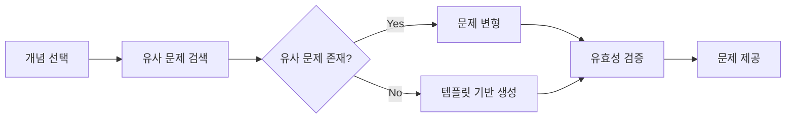
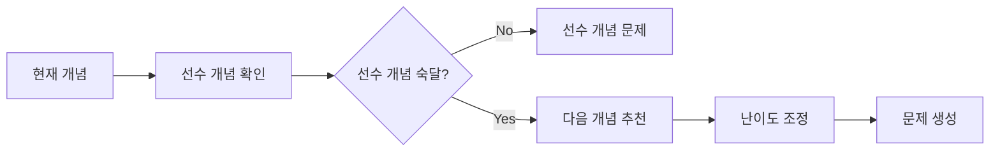

# AI 수학 튜터 - RAG 기반 문제 생성 시스템

## 1. 핵심 기능 구조
```
aiMathTutor/
├── core/
│   ├── rag/
│   │   ├── embeddings.py     # 임베딩 생성 및 관리
│   │   ├── retriever.py      # 유사 문제 검색
│   │   └── generator.py      # 문제 생성 로직
│   ├── problem/
│   │   ├── repository.py     # 문제 저장소
│   │   ├── validator.py      # 문제 유효성 검증
│   │   └── formatter.py      # 문제 포맷 변환
│   └── knowledge/
│       ├── graph.py          # 지식 그래프 관리
│       └── concepts.py       # 개념 관계 정의
├── data/
│   ├── problems/             # 기존 문제 데이터베이스
│   │   └── fifth_grade_problems_all_english_v2.json  # RAG 기반 문제 생성용 데이터셋
│   ├── embeddings/           # 임베딩 벡터 저장소
│   │   └── vector_embeddings.bin     # 문제 임베딩 벡터 저장 파일
│   └── knowledge_base/       # 수학 개념 지식베이스
│       └── knowledge_map.json        # 지식맵 및 추천 문제 생성용 데이터
└── utils/
    ├── vector_store.py       # 벡터 DB 관리
    └── cache_manager.py      # 캐시 관리
```

## 2. RAG 기반 핵심 함수 정의

  - fifth_grade_problems_all_english_v2.json  (RAG에서 정의된 문제 생성할 때 사용함) 
  - knowledge_map.json   (지식맵, 추천 문제를 생성할 때 사용합니다.) 

### 2.1 임베딩 및 검색 시스템
```python
class ProblemEmbedding:
    def __init__(self):
        self.model = SentenceTransformer('paraphrase-multilingual-mpnet-base-v2')
        self.vector_store = VectorStore()

    def create_embedding(self, problem_text: str) -> np.ndarray:
        """문제 텍스트를 임베딩 벡터로 변환"""
        return self.model.encode(problem_text, normalize_embeddings=True)

    def batch_embed_problems(self, problems: List[dict]) -> None:
        """다수의 문제를 임베딩하여 벡터 DB에 저장"""
        embeddings = [self.create_embedding(p['text']) for p in problems]
        self.vector_store.add_vectors(embeddings, problems)

class ProblemRetriever:
    def __init__(self, embedding_model: ProblemEmbedding):
        self.embedding_model = embedding_model
        self.cache = CacheManager()

    async def find_similar_problems(self, 
                                  concept: str, 
                                  difficulty: str,
                                  top_k: int = 5) -> List[dict]:
        """개념과 난이도에 맞는 유사 문제 검색"""
        cache_key = f"{concept}_{difficulty}"
        if cached := self.cache.get(cache_key):
            return cached

        query_embedding = self.embedding_model.create_embedding(concept)
        similar_problems = self.embedding_model.vector_store.search(
            query_embedding,
            filter_params={'difficulty': difficulty},
            limit=top_k
        )
        
        self.cache.set(cache_key, similar_problems)
        return similar_problems
```

### 2.2 문제 생성 및 변형 시스템
```python
class ProblemGenerator:
    def __init__(self, retriever: ProblemRetriever):
        self.retriever = retriever
        self.template_engine = Jinja2Templates("templates")

    async def generate_problem(self, 
                             concept: str, 
                             difficulty: str) -> dict:
        """유사 문제를 기반으로 새로운 문제 생성"""
        # 유사 문제 검색
        similar_problems = await self.retriever.find_similar_problems(
            concept, difficulty
        )
        
        if not similar_problems:
            return self._generate_from_template(concept, difficulty)

        # 문제 변형
        new_problem = await self._modify_problem(
            random.choice(similar_problems)
        )
        
        return self._validate_and_format(new_problem)

    async def _modify_problem(self, base_problem: dict) -> dict:
        """기존 문제의 숫자와 조건을 변경하여 새로운 문제 생성"""
        template = self._extract_template(base_problem)
        new_values = self._generate_new_values(base_problem)
        
        return self.template_engine.render(
            template,
            values=new_values
        )

    def _validate_and_format(self, problem: dict) -> dict:
        """생성된 문제의 유효성 검사 및 포맷팅"""
        validator = ProblemValidator()
        if not validator.is_valid(problem):
            return self._generate_from_template(
                problem['concept'],
                problem['difficulty']
            )
        
        return ProblemFormatter.format(problem)
```

### 2.3 지식 그래프 기반 추천
```python
class KnowledgeGraph:
    def __init__(self):
        self.graph = nx.DiGraph()
        self.load_concept_relationships()

    def recommend_next_problems(self, 
                              current_concept: str,
                              user_performance: dict) -> List[str]:
        """현재 개념과 사용자 성과를 기반으로 다음 문제 추천"""
        # 선수 개념 확인
        prerequisites = self.get_prerequisites(current_concept)
        if not self._check_prerequisites_mastery(prerequisites, user_performance):
            return self._get_prerequisite_problems(prerequisites)

        # 다음 개념 추천
        next_concepts = self.get_next_concepts(current_concept)
        return self._get_concept_problems(next_concepts, user_performance)

    def _check_prerequisites_mastery(self,
                                   prerequisites: List[str],
                                   performance: dict) -> bool:
        """선수 개념 숙달도 확인"""
        return all(
            performance.get(concept, 0) >= 0.7
            for concept in prerequisites
        )
```

## 3. 핵심 동작 프로세스

### 3.1 문제 생성 흐름


### 3.2 추천 시스템 흐름


## 4. 성능 최적화

### 4.1 캐싱 전략
```python
@cache_manager.cached(ttl=3600)
async def get_problem_recommendations(concept: str, 
                                   user_id: str) -> List[dict]:
    """사용자별 문제 추천 결과 캐싱"""
    performance = await get_user_performance(user_id)
    graph = KnowledgeGraph()
    return graph.recommend_next_problems(concept, performance)
```

### 4.2 벡터 검색 최적화
```python
class VectorStore:
    def __init__(self):
        self.index = faiss.IndexFlatL2(768)  # BERT 임베딩 차원
        self.metadata = []

    def add_vectors(self, 
                   vectors: np.ndarray, 
                   metadata: List[dict]) -> None:
        """벡터와 메타데이터를 효율적으로 저장"""
        if self.index.ntotal == 0:
            self.index = faiss.IndexIVFFlat(
                self.index, 768, min(len(vectors), 100)
            )
            self.index.train(vectors)
        
        self.index.add(vectors)
        self.metadata.extend(metadata)
```

## 5. 확장성 고려사항

### 5.1 새로운 문제 유형 추가
- 템플릿 기반 시스템으로 쉽게 확장
- 임베딩 모델 교체 가능성 고려
- 다양한 문제 생성 전략 플러그인 지원

### 5.2 성능 모니터링
- 문제 생성 품질 측정
- 사용자 피드백 수집
- 추천 시스템 정확도 추적


ProblemRepository: 문제 저장 및 관리
ProblemGenerator: 문제 생성 로직
ProblemValidator: 문제 유효성 검증
ProblemFormatter: 문제 포맷 변환
OpenAIClient: OpenAI API 호출


이제 학습 경로 시스템이 구현되었습니다. 주요 기능은 다음과 같습니다:
지식 맵 관리 (knowledge_map.json)
수학 개념들의 계층 구조 정의
선수 개념과 후속 개념 관계 정의
각 개념별 난이도와 숙달도 기준 정의
학습 경로 정의
학습 경로 관리 (LearningPathManager)
지식 맵 로드 및 그래프 구성
사용자의 개념 준비도 확인
다음 학습할 개념 추천
학습 경로 진행 상황 추적
사용자 진행 상황 관리 (UserProgressManager)
개념별 숙달도 추적
학습 경로 완료 상태 관리
업적 시스템 관리
사용자 활동 기록
학습 경로 시각화 (PathVisualizer)
학습 경로 시각적 표현
진행 상황 표시
개념별 상태 카드 표시
추천 난이도 표시
이 시스템을 통해 다음과 같은 이점을 얻을 수 있습니다:
체계적인 학습 경로
선수 학습이 필요한 개념을 먼저 학습
개념 간의 연관성을 고려한 학습 순서
사용자의 수준에 맞는 난이도 조절
개인화된 학습 경험
사용자의 진행 상황에 따른 맞춤형 추천
숙달도 기반의 난이도 조정
업적 시스템을 통한 동기 부여
진행 상황 시각화
직관적인 학습 경로 표시
실시간 진행 상황 확인
선수 개념 상태 확인
확장성
새로운 개념과 학습 경로 추가 용이
다양한 학습 전략 적용 가능
사용자 피드백 기반의 시스템 개선
이제 사용자는 자신의 수준과 목표에 맞는 학습 경로를 선택하고, 체계적으로 수학 개념을 학습할 수 있습니다.


